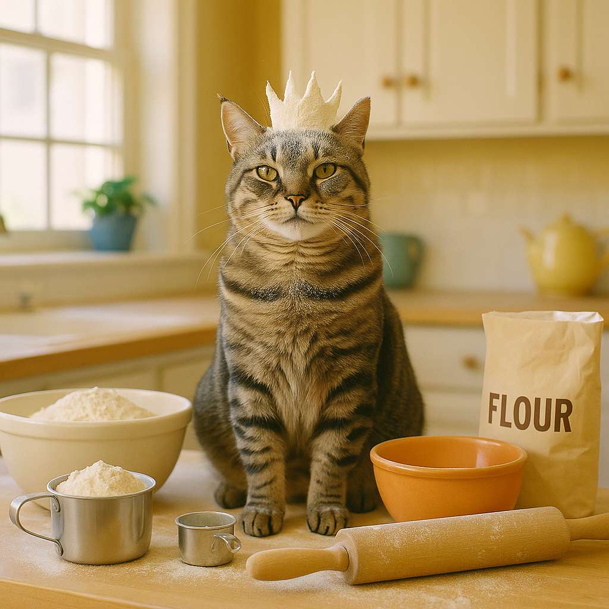

Once upon a time in a cozy little house, there lived a mischievous cat named Whiskers. Whiskers had a knack for getting into trouble, and his favorite pastime was to sneak into the kitchen and steal treats when no one was looking. One sunny afternoon, he spotted a delicious-looking pie cooling on the windowsill. With his eyes wide and his tail twitching, he devised a plan to snatch it without being caught. .

As Whiskers made his move, he leaped onto the counter with the grace of a ninja. However, in his excitement, he knocked over a jar of flour, creating a cloud of white powder that engulfed him. When his owner walked in, all she could see was a fluffy white cat with a guilty expression, looking like a snowman gone wrong. Instead of being angry, she burst into laughter, and Whiskers, realizing he had become the star of the show, struck a pose as if he were the king of the kitchen. .

From that day on, Whiskers was known as the "Flour King" in the neighborhood. His antics became legendary, and every time someone baked a pie, they would leave a little bit of flour out just for him. Whiskers had turned his kitchen caper into a delightful tradition, proving that sometimes, a little mischief can lead to a lot of laughter. .